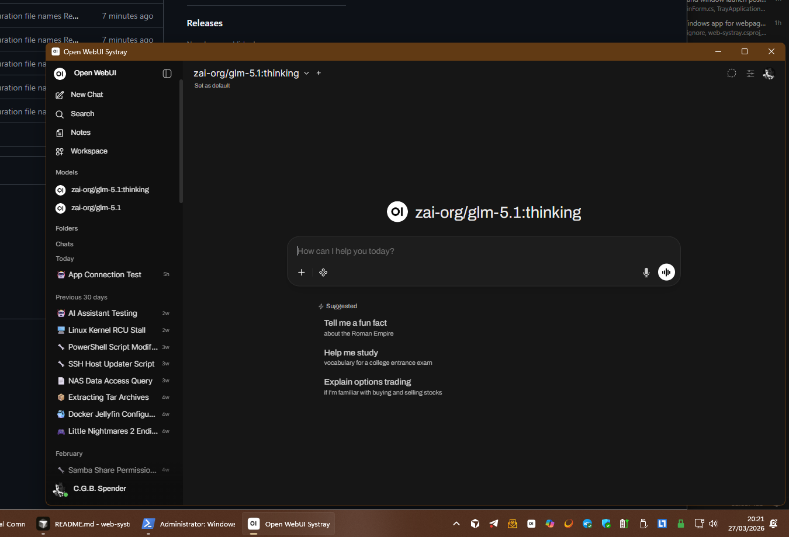

> **Note:** This project was created with the help of **AI** using [**Cursor**](https://cursor.com/). Human judgment still applies; the disclosure is here for anyone who wants to know how the code came together.

> *Third-party:* This is an independent tool and is not officially affiliated with the [Open WebUI](https://github.com/open-webui/open-webui) project.

> [!TIP]
> **Looking for Windows?** This README is for the **Linux** build. For **Windows** (.NET), use the [**main** branch](https://github.com/hugalafutro/open-webui-systray) - same idea, native system tray on Windows.

# Open WebUI Systray

Small **Linux / KDE Plasma 6** system tray application that opens an **[Open WebUI](https://github.com/open-webui/open-webui)** (or any **HTTPS**) instance inside an embedded **Qt WebEngine** (Chromium) window. Run it, park it in the tray, and show or hide the window from the icon.



## Requirements

- **Linux** with a working **system tray** / StatusNotifier (e.g. KDE Plasma 6)
- **Python 3.10+**
- **PyQt6** and **PyQt6-WebEngine** (Chromium-based; distro packages or `pip`)

Plasma may need `libxcb-cursor0` (or your distro’s equivalent) for some Qt features.

## Install (virtual environment)

From the repository root:

```bash
python3 -m venv .venv
source .venv/bin/activate
pip install -e .
```

**KDE global shortcut (optional):** On Plasma, if **`gdbus`** is available (typically via GLib, e.g. `glib2` on Arch), the app registers **Ctrl+Alt+O** with **`org.kde.kglobalaccel`** to show/hide the window. Registration is skipped if the session is not KDE/Plasma, **`gdbus`** is missing, or the shortcut cannot be applied (e.g. conflict). Qt **QtDBus** (`PyQt6.QtDBus`) is used to receive the key-press signal.

## Run

After install:

```bash
open-webui-systray
```

Or without installing (dev):

```bash
chmod +x run.sh
./run.sh
```

## Sync from git and global command (`install.sh`)

If you keep a **git clone** of this repo and want **`open-webui-systray` on your PATH** (from any directory), run from the repository root:

```bash
chmod +x install.sh
./install.sh
```

This runs **`git pull`**, ensures **`.venv`** exists, runs **`pip install -e .`**, and installs a small **wrapper** at **`~/.local/bin/open-webui-systray`**. The wrapper uses the **absolute path** to this clone’s venv and applies the same **Wayland** `QT_QPA_PLATFORM=xcb` behavior as [`run.sh`](run.sh). Re-run `./install.sh` after moving the clone or to refresh the wrapper.

If **`~/.local/bin`** is not already on your **`PATH`**, add something like `export PATH="$HOME/.local/bin:$PATH"` to your shell configuration; the script prints a reminder when it detects that.

Optional: **`./install.sh --launch`** performs the same steps and then starts the app **in the background** (same single-instance rules as a normal launch).

## Configuration

On first run (or if no valid config exists), a dialog asks for the **HTTPS URL** of your server (for example your Open WebUI URL).

Settings are stored under **`$XDG_CONFIG_HOME/open-webui-systray/open-webui-systray.cfg`** (usually `~/.config/open-webui-systray/open-webui-systray.cfg`): exactly one non-comment URL line plus optional `key=value` settings. Lines starting with `#` are ignored.

Only **https://** URLs with a host are accepted.

Optional setting:

```ini
https://example.com
zoom_factor=1.0
```

`zoom_factor` is optional, defaults to `0.9`, and is clamped to a safe range if set.

**Qt WebEngine profile** (cookies, cache, etc.) lives under **`$XDG_DATA_HOME/open-webui-systray/`** (typically `~/.local/share/open-webui-systray/`).

## Behavior

- **Single instance** - a second copy exits immediately (lock file under `$XDG_RUNTIME_DIR` or a temp fallback).
- **Tray icon** - left-click shows or focuses the browser window; **Quit** is in the tray context menu.
- **Close button** - hides the window to the tray (does not exit the app).
- **Resume recovery** - after long tray-hidden periods, the app reloads the configured URL on restore and recreates the embedded browser if the Qt WebEngine renderer has died.
- **Same-host navigation** - the embedded browser only allows same-host `http`/`https` navigations, fragment-only URLs, and `about:blank`.
- **Missing WebEngine dependency** - if Qt WebEngine is unavailable at startup, the app shows an actionable install error instead of crashing on import.

## Project layout

- `pyproject.toml` - Python package metadata and dependencies
- `data/` - packager metadata (`.desktop` entry, icons)
- `scripts/render_app_icons.py` - optional: regenerate theme PNGs when changing the in-app icon
- `run.sh` - run from a clone without `pip install`
- `install.sh` - `git pull`, refresh editable install, install `~/.local/bin/open-webui-systray` (optional `--launch`)
- `src/open_webui_systray/` - application code (`__main__.py`, config, dialog, tray, main window)

## License

This project is released under the [MIT License](LICENSE). Qt and Qt WebEngine are subject to their respective licenses (LGPL/GPL and Chromium components as shipped by the Qt Company / your distribution).
